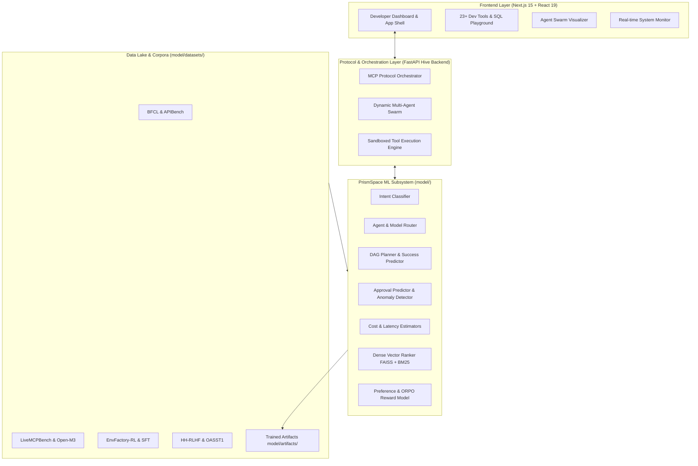

# Prism Dev Browser (PrismSpace Web)

An AI-powered developer operating environment, browser dashboard, and multi-agent orchestration platform built with **Next.js 15**, **React 19**, **TypeScript**, **Tailwind CSS**, and a **Python FastAPI Hive Backend** supporting the **Model Context Protocol (MCP)** and an end-to-end **Machine Learning Routing, Planning & Alignment Subsystem**.


---

## 📑 Table of Contents

- [System Architecture](#-system-architecture)
- [Machine Learning Models & Alignment](#-machine-learning-models--alignment)
  - [Decision & Routing Models](#1-decision--routing-models)
  - [Dense Retrieval & Semantic Ranking](#2-dense-retrieval--semantic-ranking)
  - [ORPO Reward & Preference Alignment](#3-orpo-reward--preference-alignment)
- [Datasets & Benchmark Sources](#-datasets--benchmark-sources)
- [Dataset Directory Structure & Ingestion](#-dataset-directory-structure--ingestion)
- [Quick Start: Run, Train & Test](#-quick-start-run-train--test)
  - [Prerequisites](#prerequisites)
  - [1. Frontend & Backend Quick Start](#1-frontend--backend-quick-start)
  - [2. Machine Learning Environment Setup](#2-machine-learning-environment-setup)
  - [3. Training Commands](#3-training-commands)
  - [4. Model Testing & Inference Commands](#4-model-testing--inference-commands)
  - [5. Evaluation Commands](#5-evaluation-commands)
- [Core Features](#-core-features)
- [Project Directory Layout](#-project-directory-layout)
- [Documentation & References](#-documentation--references)

---

## 🏛️ System Architecture

PrismSpace is structured into four decoupled, modular layers designed for high-performance developer workflows and intelligent multi-agent collaboration:



1. **Presentation & Developer Workspace (`app/`, `components/`)**: Next.js 15, React 19, Tailwind CSS, providing glassmorphic themes, 15+ customizable clock styles, SQL Playground with WASM SQLite, and interactive Agent Swarm consoles.
2. **Hive Protocol Engine (`backend/`)**: FastAPI server implementing the [Model Context Protocol (MCP)](https://modelcontextprotocol.io/) for agent discovery, tool registration, and multi-agent execution graphs.
3. **ML Decision & Policy Layer (`model/`)**: Tabular, tree-based, and neural models that route developer prompts, evaluate DAG execution plans, predict tool execution risks, rank retrieved context, and optimize preference trajectories.
4. **Data & Telemetry Lake (`model/datasets/`)**: Multi-source dataset loader normalizing JSON, JSONL, Parquet, and compressed streams into canonical supervised and preference tensors.

---

## 🧠 Machine Learning Models & Alignment

The `model/` package provides specialized models designed for high-throughput, low-latency inference:

### 1. Decision & Routing Models

| Model Artifact | Implementation File | Function & Architecture |
| :--- | :--- | :--- |
| `intent_classifier.joblib` | `model/intent_classifier.py` | TF-IDF feature extraction with calibrated multi-class classifier mapping prompts to execution intents (Code, Search, Navigation, Terminal, SQL, Debug). |
| `agent_router.joblib` | `model/agent_router.py` | Predicts the optimal specialized agent from the swarm (e.g. `CodeExpert`, `BrowserAgent`, `SQLSpecialist`, `MCPToolAgent`) given task embeddings. |
| `model_router.joblib` | `model/model_router.py` | Routes sub-tasks to the most cost-effective LLM provider/tier (Claude 3.5 Sonnet, GPT-4o, Gemini 1.5 Pro, Local Llama). |
| `workflow_success_predictor.joblib` | `model/workflow_success_predictor.py` | Analyzes dependency DAGs and sub-goal features to forecast probability of task completion before dispatch. |
| `approval_predictor.joblib` | `model/approval_predictor.py` | Risk-scoring model for Human-in-the-Loop (HITL) governance; flags destructive commands (e.g. file deletion, remote commits, environment modification). |
| `latency_predictor.joblib` | `model/cost_latency_predictor.py` | Regression model estimating execution time ($ms$) across planned tool paths. |
| `cost_predictor.joblib` | `model/cost_latency_predictor.py` | Predicts token consumption and API pricing per execution graph. |
| `anomaly_detector.joblib` | `model/anomaly_detector.py` | Isolation Forest / One-Class classifier detecting runaway agent loops, recursive tool invocations, and prompt injection traces. |

### 2. Dense Retrieval & Semantic Ranking

* **File**: `model/retrieval_ranker.py`
* **Architecture**: Hybrid dense-sparse retrieval combining **FAISS (Facebook AI Similarity Search)** vector embeddings with **BM25 / TF-IDF** lexical scoring.
* **Capabilities**: Indexes codebase symbols, MCP tool specifications, documentation, and agent memory vectors for low-latency context injection into agent prompts.

### 3. ORPO Reward & Preference Alignment

* **File**: `model/reward_model.py`
* **Theory & Paradigm**: Implements **ORPO (Odds Ratio Preference Optimization)** based on [Hong et al., EMNLP 2024 (arXiv:2403.07691)](https://arxiv.org/abs/2403.07691).
* **Mechanism**:
  Unlike classic RLHF (which trains a separate reward model followed by PPO policy optimization) or standard DPO (which requires maintaining a frozen reference model $\pi_{\text{ref}}$ in GPU memory), **ORPO embeds preference penalty directly into the Supervised Fine-Tuning loss**:
  $$\mathcal{L}_{\text{ORPO}} = \mathcal{L}_{\text{SFT}} + \lambda \cdot \mathcal{L}_{\text{OR}}$$
  where the odds ratio penalty is given by:
  $$\mathcal{L}_{\text{OR}} = - \log \sigma \left( \log \left( \frac{\text{odds}_\theta(y_w|x)}{\text{odds}_\theta(y_l|x)} \right) \right)$$
* **Application in PrismSpace**: Evaluates agent action trajectories (`_chosen` vs `_rejected`) extracted from datasets like `EnvFactory-RL` and `HH-RLHF`, training the agent to favor efficient tool API invocations over redundant UI exploration steps.

---

## 📊 Datasets & Benchmark Sources

PrismSpace trains its ML subsystem across the following benchmarks and preference corpora:

| Dataset / Benchmark | Source & Direct Link | Primary Role in PrismSpace |
| :--- | :--- | :--- |
| **ScaleAI LHAW** | [HuggingFace: ScaleAI/lhaw](https://huggingface.co/datasets/ScaleAI/lhaw) | Long-Horizon Agentic Workflows; multi-step DAG planning & dependency tracking. |
| **Bordair Multimodal** | [HuggingFace: Bordair/bordair-multimodal](https://huggingface.co/datasets/Bordair/bordair-multimodal) | Multimodal prompt security, jailbreak detection & safe tool authorization. |
| **EnvFactory-RL** | [HuggingFace: LARK-Lab/EnvFactory-RL](https://huggingface.co/datasets/LARK-Lab/EnvFactory-RL) | Reinforcement learning environment action trajectories & reward modeling. |
| **EnvFactory-SFT** | [HuggingFace: LARK-Lab/EnvFactory-SFT-FILTERED](https://huggingface.co/datasets/LARK-Lab/EnvFactory-SFT-FILTERED) | Tool-use supervised fine-tuning and agent instruction following. |
| **LiveMCPBench** | [HuggingFace: ICIP/LiveMCPBench](https://huggingface.co/datasets/ICIP/LiveMCPBench) | Standardized Model Context Protocol (MCP) server & tool interaction benchmark. |
| **Open-M3-Bench** | [HuggingFace: EtaYang10th/Open-M3-Bench](https://huggingface.co/datasets/EtaYang10th/Open-M3-Bench) | Multi-agent collaboration templates and dynamic swarm orchestration. |
| **BFCL (Berkeley Leaderboard)** | [HuggingFace: gorilla-llm/Berkeley-Function-Calling-Leaderboard](https://huggingface.co/datasets/gorilla-llm/Berkeley-Function-Calling-Leaderboard) | Function-calling precision, AST parameter verification, and tool-agent routing. |
| **AgentInstruct** | [HuggingFace: THUDM/AgentInstruct](https://huggingface.co/datasets/THUDM/AgentInstruct) | Broad agent instruction taxonomies across diverse software tasks. |
| **APIBench (Gorilla)** | [HuggingFace: gorilla-llm/APIBench](https://huggingface.co/datasets/gorilla-llm/APIBench) | API intent classification and argument extraction across REST & SDK tools. |
| **Anthropic HH-RLHF** | [HuggingFace: Anthropic/hh-rlhf](https://huggingface.co/datasets/Anthropic/hh-rlhf) | Human preference pairs (`chosen` / `rejected`) for safety and helpfulness alignment. |
| **OpenAssistant OASST1** | [HuggingFace: OpenAssistant/oasst1](https://huggingface.co/datasets/OpenAssistant/oasst1) | Multi-turn conversational preference trees and quality ranking. |
| **Tau-Bench** | [GitHub: sierra-research/tau-bench](https://github.com/sierra-research/tau-bench) | Dynamic user-agent tool environment trajectories. |
| **BEIR** | [GitHub: beir-cellar/beir](https://github.com/beir-cellar/beir) | Information retrieval benchmark for dense & sparse vector search evaluation. |
| **LMSYS Chatbot Arena** | [HuggingFace: lmsys/lmsys-chatbot-arena-conversations](https://huggingface.co/datasets/lmsys/lmsys-chatbot-arena-conversations) | Real-world dialogues for provider routing (`openai`, `anthropic`, `google`) by task capability. |
| **RouterBench** | [HuggingFace: withmartian/routerbench](https://huggingface.co/datasets/withmartian/routerbench) | LLM routing benchmark for multi-provider performance and cost optimization. |
| **xRouteBench** | [HuggingFace: ulab-ai/xRouteBench](https://huggingface.co/datasets/ulab-ai/xRouteBench) | Multi-candidate execution benchmarks across diverse LLM tasks. |

---

## 📁 Dataset Directory Structure & Ingestion

All training records are ingested by `model/dataset_loader.py` and curated by `model/prepare_supervised_datasets.py`. Place dataset files in subfolders under `model/datasets/`:

```
prismspace-web/
├── model/
│   ├── datasets/
│   │   ├── APIBench/                            # JSON / JSONL API tool datasets
│   │   ├── AgentInstruct/                       # Parquet / JSON agent instructions
│   │   ├── Berkeley-Function-Calling-Leaderboard/ # BFCL tool-calling records
│   │   ├── EnvFactory-RL/                       # RL trajectory reward files
│   │   ├── EnvFactory-SFT-FILTERED/             # Tool-use SFT traces
│   │   ├── LiveMCPBench/                        # MCP benchmark traces
│   │   ├── OPen-m3-bench/                       # Multi-agent workflow templates
│   │   ├── agent-llm-traces/                    # Execution logs & run traces
│   │   ├── beir/                                # Retrieval corpora
│   │   ├── hh-rlhf/                             # Pairwise preference datasets (.jsonl.gz / .jsonl)
│   │   ├── oasst1/                              # Conversational assistant trees
│   │   ├── tau-bench-trajectories/              # Interactive environment logs
│   │   ├── lmsyschatbot_arena_conversations/    # *.parquet from LMSYS Arena for Provider Router
│   │   ├── routerbench/                         # *.pkl files from RouterBench for Provider Router
│   │   └── xRouteBench/                         # llm_candidates/ & query Parquet files
```

### Supported File Formats & Normalization
- **Supported extensions**: `.json`, `.jsonl`, `.csv`, `.parquet`, `.txt`, `.json.gz`, `.jsonl.gz`.
- **Automatic Canonicalization**:
  The loader automatically identifies and maps heterogeneous columns into canonical internal training fields:
  - `_text`: Formatted query/prompt text from `prompt`, `question`, `instruction`, `text`, or `conversation`.
  - `_intent_label`: Extracted target intent domain.
  - `_agent_label`: Recommended agent or tool name.
  - `_approval_label`: Binary flag indicating if elevated permission/approval was required.
  - `_chosen` & `_rejected`: Paired preference outputs for ORPO and pairwise reward modeling.

---

## 🚀 Quick Start: Run, Train & Test

### Prerequisites
- **Node.js**: 18.0+ & `npm` / `pnpm`
- **Python**: 3.10+
- **NVIDIA GPU** (Optional): CUDA 12.6+ recommended for transformer fine-tuning and PyTorch acceleration.

---

### 1. Frontend & Backend Quick Start

```powershell
# 1. Install frontend dependencies
npm install

# 2. Launch the Next.js Dev Server (runs on http://localhost:3000)
npm run dev

# 3. In a separate terminal, launch the Hive API Backend (runs on http://localhost:8000)
.\backend\start.ps1
```

*(On Linux / macOS, start the backend with: `uvicorn backend.app:app --host 0.0.0.0 --port 8000 --reload`)*

---

### 2. Machine Learning Environment Setup

From the project root:

```powershell
# Create and activate Python virtual environment
python -m venv .venv
Set-ExecutionPolicy -Scope Process -ExecutionPolicy Bypass
.\.venv\Scripts\Activate.ps1

# Upgrade pip and install PyTorch with CUDA 12.6 support
python -m pip install --upgrade pip
python -m pip install torch torchvision torchaudio --index-url https://download.pytorch.org/whl/cu126

# Install ML requirements
python -m pip install -r model\requirements.txt
```

Verify GPU availability:
```powershell
python -c "import torch; print('CUDA available:', torch.cuda.is_available()); print('Device:', torch.cuda.get_device_name(0) if torch.cuda.is_available() else 'CPU Fallback')"
```

---

### 3. Training Commands

#### A. Quick Smoke-Test Run (1,000 samples per source)
Fast end-to-end dry run to verify dataset ingestion, feature engineering, and pipeline integrity:
```powershell
python -m model.train --dataset-dir model\datasets --output-dir model\artifacts_test --max-rows-per-file 1000
```

#### B. Full Production Training Run
Scans all datasets under `model/datasets/`, trains routing, planning, and safety models, and outputs `.joblib` model artifacts to `model/artifacts/`:
```powershell
python -m model.train --dataset-dir model\datasets --output-dir model\artifacts --max-rows-per-file 50000
```

---

### 4. Model Testing & Inference Commands

Test trained model artifacts on arbitrary developer prompts:

```powershell
# Test Intent Classification
python -m model.predict model\artifacts\intent_classifier.joblib "Analyze the slow SQL query and create an index migration"

# Test Swarm Agent Routing
python -m model.predict model\artifacts\agent_router.joblib "Launch a headless browser and verify the OAuth redirect flow"

# Test Human Approval Escalation Prediction
python -m model.predict model\artifacts\approval_predictor.joblib "Drop table users in production database"

# Test Python Inference API Suite
python backend\test_model_inference.py
```

---

### 5. Evaluation Commands

Compute accuracy, precision, recall, F1 scores, ROC-AUC, and latency benchmarks across trained models:

```powershell
python -m model.evaluate --output-dir model\artifacts
```

This generates `evaluation_report.json` in the output artifacts directory detailing per-class metrics and model confidence scores.

---

## 🛠️ Core Features

- 🕐 **15+ Clock Styles** - Real-time customizable clock with 10+ embedded fonts and custom palettes.
- 🎨 **Glassmorphism UI** - Curated themes, live matrix display, custom wallpaper uploads.
- 🛠️ **23 Developer Utilities** - JSON toolkit, Regex workbench, Crypto utils, SQL Playground (SQLite WASM), Markdown editor, Git reference.
- 🤖 **Agent Swarm Visualizer** - Real-time visualization of multi-agent state machines, MCP server tools, and DAG execution pipelines.
- 📝 **Developer Productivity Suite** - Habit tracker, focus timer, checklist manager, decision analyzer.
- 📊 **System & Telemetry Monitor** - Live tracking of browser environment, system resources, model latencies, and token budgets.

---

## 📂 Project Directory Layout

```
prismspace-web/
├── app/                         # Next.js 15 App Router (Pages, Layouts, API Routes)
│   ├── api/                     # REST endpoints (agent-swarm, model routing)
│   ├── globals.css              # Global styles & design tokens
│   └── page.tsx                 # Main developer dashboard entry point
├── backend/                     # Python Hive FastAPI Backend
│   ├── app.py                   # FastAPI server & MCP router
│   ├── model_inference.py       # Inference endpoint integration
│   ├── test_model_inference.py  # Model test suite
│   └── start.ps1                # Backend startup script
├── components/                  # React 19 UI Components
│   ├── AgentSwarm.tsx           # Swarm multi-agent orchestrator interface
│   ├── Clock.tsx                # Clock component
│   ├── DevSpace.tsx             # 23-tool developer workbench
│   ├── SettingsModal.tsx        # System settings & customization
│   └── tools/                   # Embedded developer tools (SQL Playground, etc.)
├── model/                       # Machine Learning Subsystem
│   ├── artifacts/               # Serialized production model artifacts (.joblib)
│   ├── datasets/                # Multi-source training datasets
│   ├── dataset_loader.py        # Schema-free multi-format dataset ingestion
│   ├── intent_classifier.py     # Intent classification model
│   ├── agent_router.py          # Swarm agent routing model
│   ├── model_router.py          # LLM provider routing model
│   ├── approval_predictor.py    # Risk-scoring & approval predictor
│   ├── workflow_success_predictor.py # DAG workflow success predictor
│   ├── cost_latency_predictor.py# Execution time & token cost estimator
│   ├── anomaly_detector.py      # Anomaly & injection detection
│   ├── retrieval_ranker.py      # Dense FAISS + sparse retrieval ranker
│   ├── reward_model.py          # ORPO & pairwise preference adapter
│   ├── train.py                 # Training CLI entry point
│   ├── predict.py               # Inference CLI entry point
│   └── evaluate.py              # Model evaluation suite
├── public/                      # Static assets (fonts, images, wallpapers)
├── package.json                 # Node dependencies
├── tailwind.config.ts           # Tailwind CSS configuration
└── tsconfig.json                # TypeScript configuration
```

---

## 📚 Documentation & References

- **[USAGE_GUIDE.md](USAGE_GUIDE.md)** — Step-by-step user guide for all 23 developer tools and clock settings.
- **[FEATURES.md](FEATURES.md)** — Detailed specification of all 50+ built-in features.
- **[MIGRATION_GUIDE.md](MIGRATION_GUIDE.md)** — Architectural design and customization manual.
- **[DEPLOYMENT.md](DEPLOYMENT.md)** — Deployment guides for Vercel, Netlify, Railway, and AWS.

### Foundational Research Papers
- **ORPO**: [Hong et al., 2024 - *ORPO: Monolithic Preference Optimization without Reference Model* (arXiv:2403.07691)](https://arxiv.org/abs/2403.07691)
- **DPO**: [Rafailov et al., 2023 - *Direct Preference Optimization* (arXiv:2305.18290)](https://arxiv.org/abs/2305.18290)
- **ToolCUA**: [Hu et al., 2026 - *ToolCUA: Optimal GUI-Tool Path Orchestration* (arXiv:2605.12481)](https://arxiv.org/abs/2605.12481)
- **MAI-UI**: [Zhou et al., 2025 - *MAI-UI: Real-World Foundation GUI Agents* (arXiv:2512.22047)](https://arxiv.org/abs/2512.22047)
- **Model Context Protocol**: [Anthropic MCP Specification](https://modelcontextprotocol.io/)

---

## 📝 License

This project is licensed under the **ISC License**.
